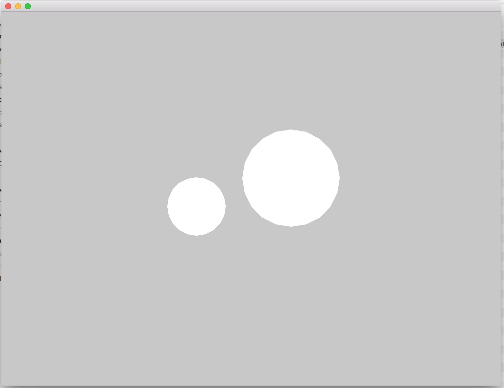
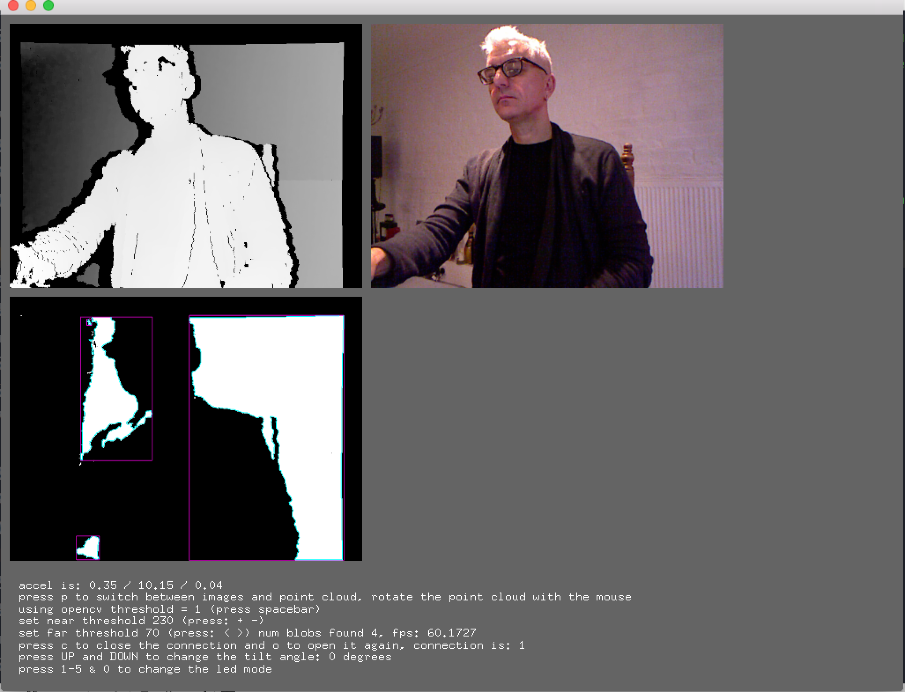
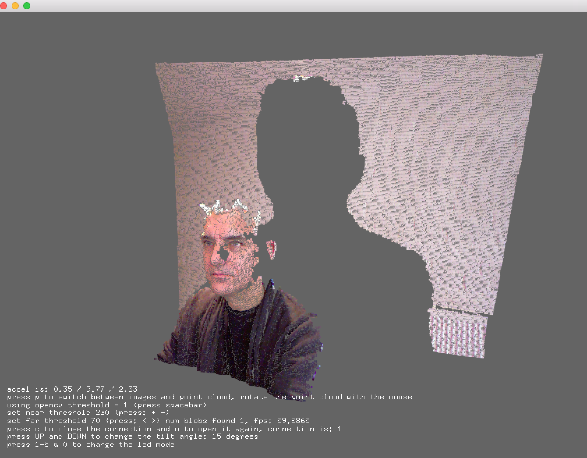
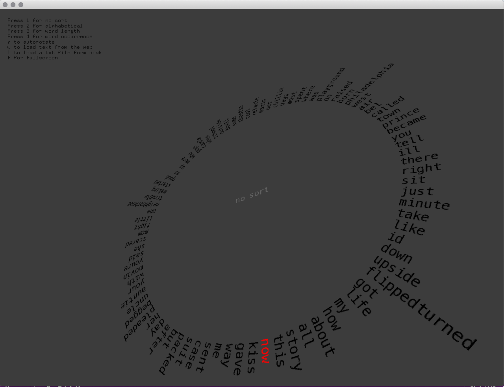
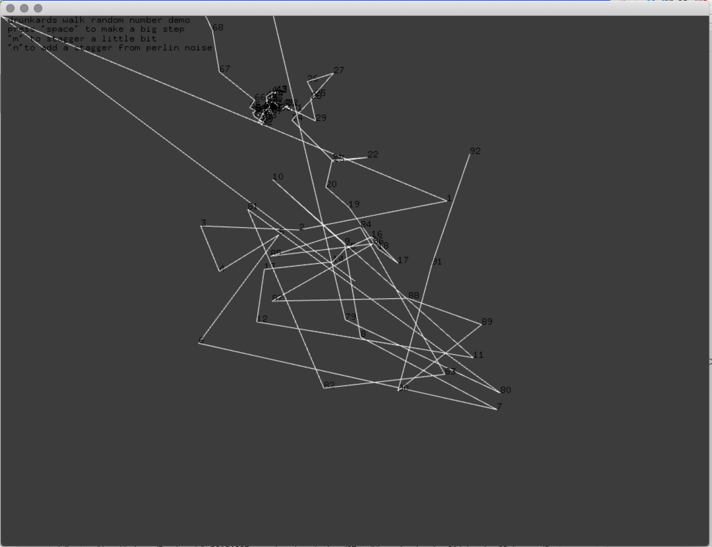
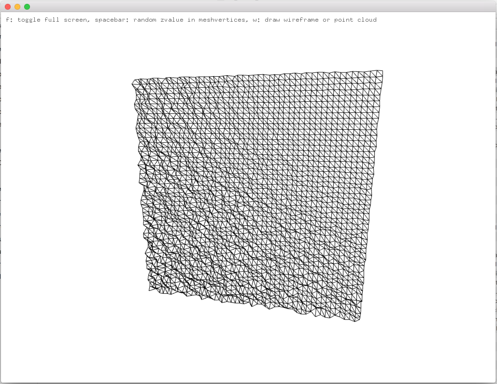
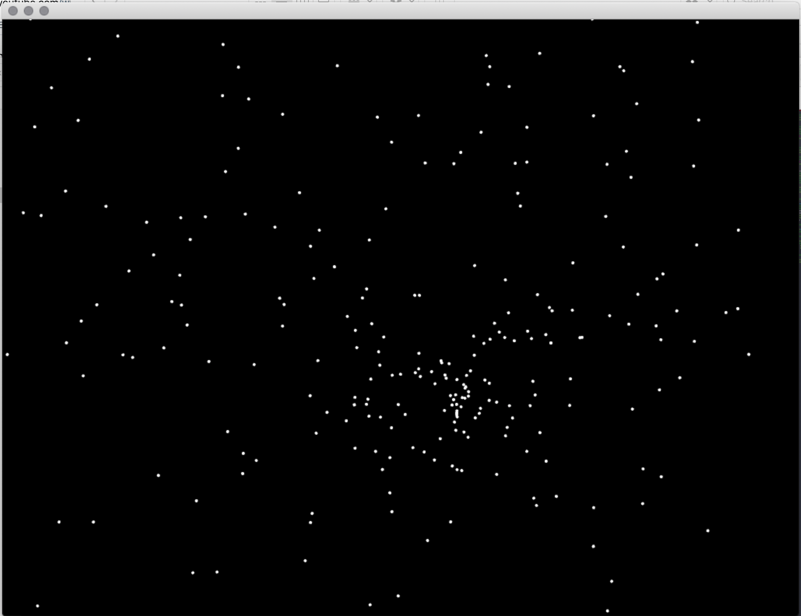

# UWE Bristol Creative Technology Toolkit sessions

example code for the Creative Technology Toolkit module on Creative Technology MSc at UWE Bristol

http://uwecreativetechnology.com

Dan Buzzo, October 2019

updated examples for raspberryPi compatibility // updates for OSX - XCODE11

https://github.com/danbz

https://buzzo.com

With acknowledgement to the work of :
OpenFrameworks Introduction course at ICON http://www.icon-brussels.be/?page_id=1142
and
the 'letsCodeExamples' from Zach Lieberman https://github.com/ofZach

# Session 1 - introduction to OpenFrameworks

• running your first code

• drawing to the screen

• getting input to a system

• using input to modify output

 

# Session 2 - images, video, complex input

• visual sensing

• camera input

• live data translation

• loops

 

# Session 3 - 3D input and 3D output to screen

• introduction to 3D

• 3D primitives, cameras

• sensing in 3D

• reading data from Kinect Sensor

 
 

# Session 4 - introduction to audio in openFrameworks

• audio output

• speech output

 

# Session 5 - introduction to complex transformation

• introduction to text processing

• intelligence and algorithms

 

# Session 6 - thinking about systems and control

• simple algorithms

• drunkards walk 3 ways including Perlin Noise

 

# Session 7 - external input and output with serial

• serial input and output with oF and arduino

• send values to serial port

• retrieve values from serial port

 

# Slit Scan Example

• Simple example to retrieve live image data from a webcam and re-draw a line at a time to the screen

 

# Mesh Example

Simple example to
• generate an openFrameworks (openframeworks.cc) mesh object

• use ofEasyCam to view our 3D scene

• populate it with vertices

• triangulate vertices and add indices to create triangle mesh

• use ofRandom() function to change the vertices z co-ordinates to distort the Mesh

 

# Simple Particle Example

• Simple example showing use of a custom 'particle' class 

• generation of our custom particle objects and placement in a vector for drawing and updating

 

 
 # Class Example - using classes in OpenFrameworks

  • writing your first class
  
  • declaring methods and parameters
  
  • drawing to the screen
  
  • making vectors of our custom objects defined by our new class
  
  this example shows a very basic demo of creating and using classes and defining class methods in C++ / openFrameworks

 
>>>>>>> ab29b8fdf87a7a13bc746cc5edf5668a893b7fd2

