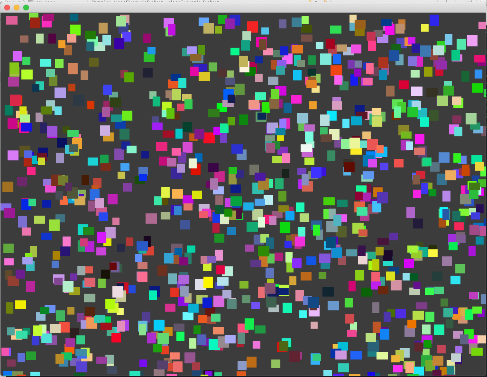

# UWE Bristol Creative Technology Toolkit Class Example

https://github.com/uwe-creative-technology/CT_toolkit_sessions

example code for the Creative Technology Toolkit module on Creative Technology MSc at UWE Bristol

http://uwecreativetechnology.com

Dan Buzzo, October 2019

https://github.com/danbz

https://buzzo.com

With acknowledgement to the work of :
OpenFrameworks Introduction course at ICON http://www.icon-brussels.be/?page_id=1142
and
the 'letsCodeExamples' from Zach Lieberman https://github.com/ofZach

# Class Example - using classes in OpenFrameworks

 • writing your first class
 • declaring methods and parameters
 • drawing to the screen
 • making vectors of our custom objects defined by our new class
 this example shows a very basic demo of creating and using classes and defining class methods in C++ / openFrameworks

