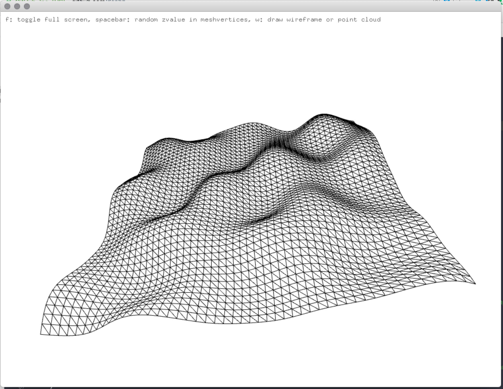

# UWE Bristol Creative Technology Toolkit sessions

https://github.com/uwe-creative-technology/CT_toolkit_sessions

example code for the Creative Technology Toolkit module on Creative Technology MSc at UWE Bristol

video walk throughs of all code examples here can be found on YouTube at

https://www.youtube.com/playlist?list=PL6QF0yo3Zj7ALxV4MyOJ9oSFsV-Mo39R2

http://uwecreativetechnology.com

Dan Buzzo, October 2019

https://github.com/danbz

https://buzzo.com

#Mesh, noise and perlin noise Example

Simple example to
• generate an openFrameworks (openframeworks.cc) mesh object
• use ofEasyCam to view our 3D scene
• populate it with vertices
• triangulate vertices and add indices to create triangle mesh
• use ofRandom() function to change the vertices z co-ordinates to distort the Mesh
• use 2 dimensional Perlin Noise() function to change the vertices z co-ordinates to distort the Mesh
 
##key controls
• f: toggle full screen 
• spacebar: random z-value in meshvertices
• w: draw wireframe or point cloud 
• p: use PerlinNoise for z-value in meshvertices
• Up-key Down-key: increase/decrease PerlinNoise input range 
• Right-key Left-key: increase/decrease amplitude of Perlin Noise distortion 
• click and drag in window to move camera

included is a compiled binary for OSX

