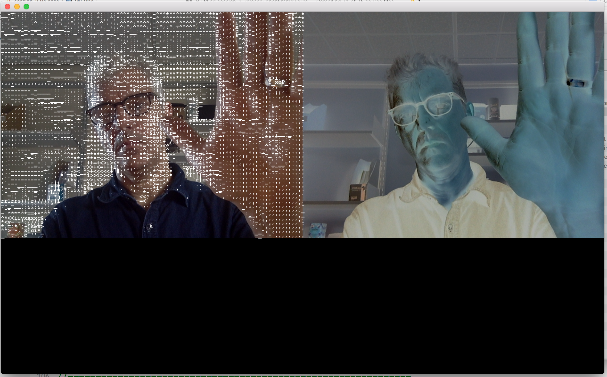

# UWE Bristol Creative Technology Toolkit session two

https://github.com/uwe-creative-technology/CT_toolkit_sessions

example code for the Creative Technology Toolkit module on Creative Technology MSc at UWE Bristol

video walk throughs of all code examples here can be found on YouTube at

https://www.youtube.com/playlist?list=PL6QF0yo3Zj7ALxV4MyOJ9oSFsV-Mo39R2

http://uwecreativetechnology.com

Dan Buzzo, October 2019
plist permissions updates for Xcode11

https://github.com/danbz

https://buzzo.com

With acknowledgement to the work of :
OpenFrameworks Introduction course at ICON http://www.icon-brussels.be/?page_id=1142
and
the 'letsCodeExamples' from Zach Lieberman https://github.com/ofZach

# Session 2

 • visual sensing

 • camera input

 • live data translation

 • loops
 
 • slit scan camera imaging

 This session shows how to instantiate a video grabber object in the header file, draw the data from that object to screen and then manipulate it. Parts based on the oF ascii vidgrabber example and including code to create a slit-scan camera http://www.flong.com/texts/lists/slit_scan/
 
 
