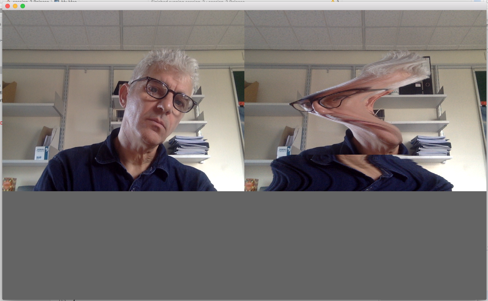

# UWE Bristol Creative Technology Toolkit sessions

https://github.com/uwe-creative-technology/CT_toolkit_sessions

example code for the Creative Technology Toolkit module on Creative Technology MSc at UWE Bristol

http://uwecreativetechnology.com

Dan Buzzo, September 2019

https://github.com/danbz

https://buzzo.com

#Slitscan Example

Simple example to retrieve live image data from a webcam and re-draw a line at a time to the screen

included is a compiled binary for OSX

 
