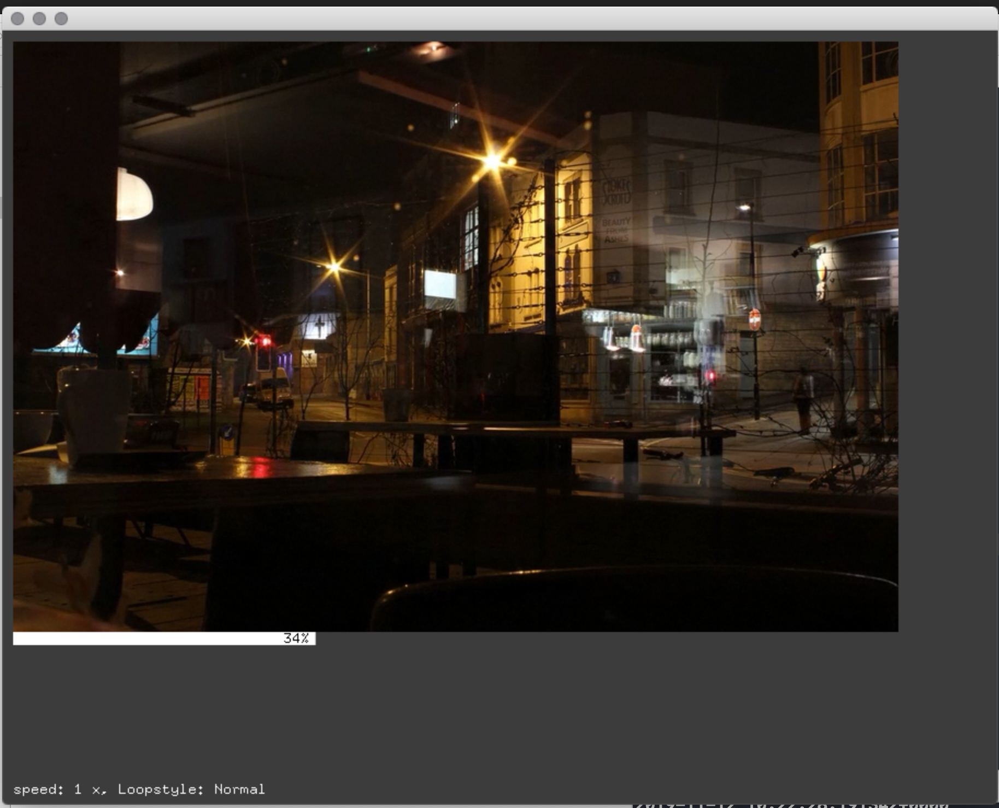

# UWE Bristol Creative Technology Toolkit sessions

https://github.com/uwe-creative-technology/CT_toolkit_sessions

example code for the Creative Technology Toolkit module on Creative Technology MSc at UWE Bristol

video walk throughs of all code examples here can be found on YouTube at

https://www.youtube.com/playlist?list=PL6QF0yo3Zj7ALxV4MyOJ9oSFsV-Mo39R2

http://uwecreativetechnology.com

Dan Buzzo, November 2019

https://github.com/danbz

https://buzzo.com

#video file playback and control

Simple example to
• use the ofVideoPlayer object to play a video file from disk
• use videoPlayer methods to control looping style and pkayback speed of our video file
• using ofMap to create a playback position indicator bar
• using mousePressed message to create simple clickable interface
• 
 
##key controls
• f: toggle full screen 
• spacebar: play and pause video
• +/-: increase or decrease playback speed
• 1: loop normal
• 2: loop palindrome (backwards and forwards)
• 3: loop none

included is a compiled binary for OSX

